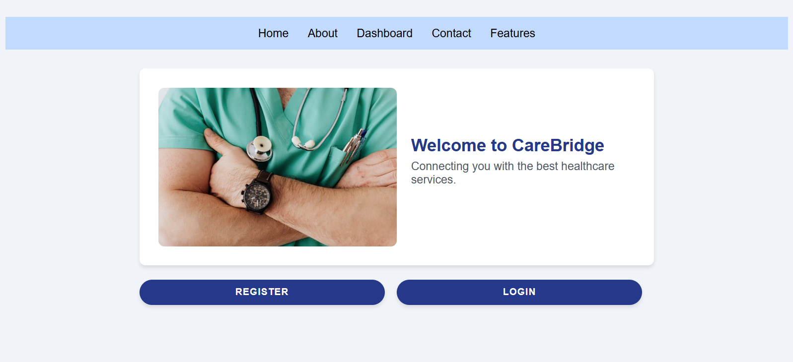

<p align="center">
  <a alt="Travel Ease logo" href="#"></a>
</p>

<h1 align="center">CareBridge</h1>
<p align="center">Connecting Patients and Doctors across Ontario!</p>
<br>

<p align="center">
  <!-- build -->
  
  <!-- release -->
  
  <!-- license -->
  
  <!-- commits per month -->
  
  <!-- languages -->
  
  <!-- top language-->
  
</p>
<br>

<!-- TABLE OF CONTENTS -->
<p align="center">
  <a href="#-about-the-project">About the project</a> •
  <a href="#-features">Features</a> •
  <a href="#-roadmap">Roadmap</a> •
  <a href="#-getting-started">Getting started</a> •
  <a href="#-license">License</a> •
  <a href="#-tech">Technical documentation</a>
</p>

## 💻 About the project

CareBridge is a web application designed to facilitate appointment scheduling between patients and doctors in Ontario. Patients can search for doctors by specialty and location, while doctors can manage their schedules and patient appointments. The system also supports assistants who can manage doctors' agendas but only for their assigned doctors.




### Built with

This project is developed using the following technologies:

#### Frontend
- [React][react] with [TypeScript][typescript] for building the UI
- [React][react] Router for navigation.

#### Backend
- [ASP.NET Core][aspdotnetcore] Web API for handling business logic.
- [Entity Framework Core][efcore] for database access and management.
- [SQL Server][sqlserver] as the relational database
- [xUnit][xunit] for unit testing
- [Moq][moq] for mocking dependencies in tests
- [JWT Authentication][jwt] for secure user access control
- [Swagger][swagger] (OpenAPI) for API documentation


## 🎨 Features

In the version 1 (V1) of the project, it is possible to:

#### Patient Features:
- [x] Search for doctors by specialty and location.
- [x] Book an appointment online.
- [x] View upcoming and past appointments.
- [x] Cancel or reschedule appointments.
- [x] Access records such as diagnostics and exam results.
- [x] Provide feedback and reviews for doctors.
- [x] Access the latest information on Ontario's Healthcare plans.

#### Doctor Features:
- [x] Set availability and manage appointment slots.
- [x] View patient history and past interactions.
- [x] Assign or remove assistants.
- [x] Cancel or reschedule appointments.
- [x] Post diagnostics and results.

#### Assistant Features:
- [x] Manage the assigned doctor's schedule.
- [x] Book and cancel appointments on behalf of the doctor.
- [x] View upcoming and past appointments for assigned doctor.

## 🎯 Roadmap

### Version 2 (V2)

- **Calendar Integration**: Connect doctor and patient schedules with external calendar services (Google Calendar, Outlook, etc.).
- **Notifications & Reminders**: Implement email and SMS notifications for appointment reminders.
- **Improved Search & Filters**: Allow patients to refine doctor searches based on insurance acceptance, availability, and ratings.
- **Admin Panel**: Provide admin users with tools to manage user roles, system settings, and overall platform activity.

### Version 3 (V3)

- **Telehealth Integration**: Enable virtual appointments with video conferencing capabilities.
- **Payment Integration**: Implement an online payment system for paid consultations.

### Version 4 (V4)

- **Multi-Province Support**: Expand the platform beyond Ontario to other provinces.
- **AI-Powered Appointment Suggestions**: Suggest optimal appointment times based on patient and doctor availability.
- **Health Monitoring Integration**: Integrate with wearable devices to allow doctors to track patient vitals remotely.
- **Offline Support**: Allow limited functionality when users are offline, syncing data once reconnected.

## 🏁 Getting started

### Prerequisites

Before setting up the project locally, ensure you have the following prerequisites ready:

1. **.NET 7+**: Install the latest .NET SDK from [here][.net7].

2. **Node.js 20+**: Required for running the frontend. Download from [here][node20+].

3. **SQL Server**: Install SQL Server and SQL Server Management Studio (SSMS) for database management. Follow installation instructions [here][sqlserver].

Once you have all these tools installed, proceed with setting up the project.

### Installation

In order to run the project locally, follow these steps:

#### Backend Setup

1. Clone the repository.

```bash
git clone https://github.com/conestoga-4term-capstone/carebridge.git
```

2. Change into the project directory:

```bash
cd carebridge-backend
```

3. Configure the backend settings:
Update the appsettings.json file with the correct database connection string and JWT settings:

```bash
"ConnectionStrings": {
    "DefaultConnection": "Server=localhost;Database=CareBridgeDb;Trusted_Connection=True;MultipleActiveResultSets=true;TrustServerCertificate=true"
  },
  "JwtSettings": {
    "SecretKey": "A_VERY_LONG_AND_SECURE_SECRET_KEY_32_CHARS_MIN",
    "Issuer": "CareBridge",
    "Audience": "CareBridgeUsers"
  }
```

4. Restore dependencies:

```bash
dotnet restore
```

5. Apply database migrations:

```bash
dotnet ef database update
```

6. Run the backend server:

```bash
dotnet run
```

#### Frontend Setup

1. Change into the frontend directory:

```bash
cd carebridge-frontend
```

2. Install dependencies:

```bash
npm install
```

3. Start the development server:

```bash
npm run dev
```

Viewing the Application

Once everything is set up, open your web browser and navigate to:

- Frontend: http://localhost:3000

- Backend API: http://localhost:5000/swagger (for API documentation)

You are now ready to start working on the project locally! 😊

## 📃 License

Distributed under the MIT License. See [LICENSE](./LICENSE) for more information.

---

## 🌟 Technical documentation

For more details about the technical roadmap, see the (upcoming) [technical documentation](./docs/README.md).

---

📬 Contact
For any inquiries or collaboration opportunities, please reach out to us at:
- Venicio Augusto Alves de Souza: venicio_augusto@hotmail.com
- Joao Eduardo Beraldo Iada: joaoed.beraldo@gmail.com


🚀 Let's build the future of healthcare together!

<!-- LINKS-->


[react]: https://react.dev/
[typescript]: https://www.typescriptlang.org/
[aspdotnetcore]: https://dotnet.microsoft.com/en-us/apps/aspnet
[efcore]: https://learn.microsoft.com/en-us/ef/core/
[sqlserver]: https://www.microsoft.com/en-ca/sql-server/sql-server-downloads
[xunit]: https://xunit.net/
[moq]: https://github.com/devlooped/moq
[swagger]: https://swagger.io/
[jwt]: https://learn.microsoft.com/en-us/aspnet/core/security/authentication/configure-jwt-bearer-authentication?view=aspnetcore-9.0
[.net7]: https://dotnet.microsoft.com/en-us/download/dotnet/7.0
[node20+]: https://nodejs.org/en/blog/release/v20.9.0
